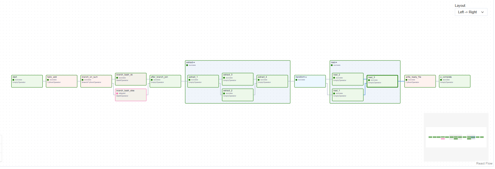
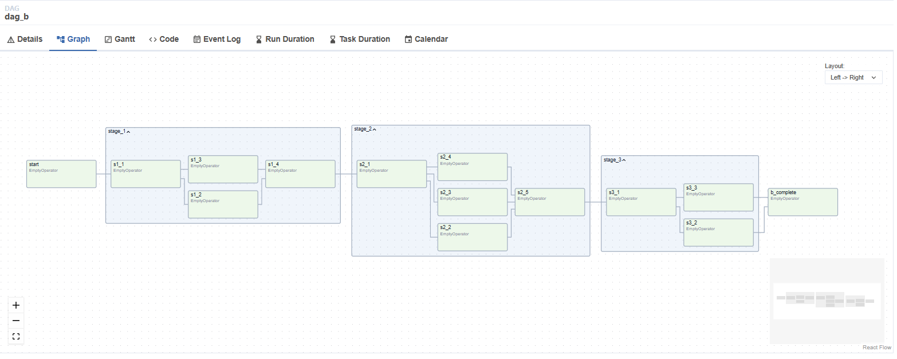
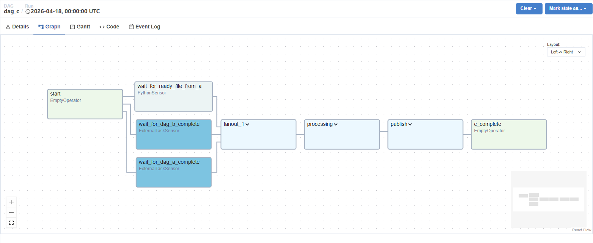

# MWAA DAG Migration — YAML-driven DAG Factory

Migrate Airflow DAGs from legacy systems to AWS MWAA using a **declarative YAML approach**. DAG definitions live in YAML config files; a generic Python loader builds the Airflow DAG objects at runtime — no per-DAG Python boilerplate required.

## Architecture

```
migration_manifest_files/          # Source: metadata extracted from the old system
  dag_manifests/*.yaml             #   per-DAG manifest (tasks, deps, operators, groups)
  dag_a.py, dag_b.py, dag_c.py    #   original Python DAG files (reference only)

scripts/
  manifest_to_dag_factory.py       # Converter: reads manifests → writes dag_factory YAML

aws-mwaa-local-runner/dags/        # Deployment target (volume-mounted into Airflow)
  dag_factory_loader.py            #   Generic YAML-to-DAG loader (Airflow 2.x & 3.x)
  dag_factory_config.yml           #   Generated YAML config (output of converter)
  include/                         #   Python callables (business logic, unchanged)
    dag_a_callables.py
    dag_c_callables.py
```

### How it works

1. **`manifest_to_dag_factory.py`** reads the legacy YAML manifests and produces a `dag_factory_config.yml` with all DAGs, tasks, task groups, dependencies, and operator configurations.

2. **`dag_factory_loader.py`** is dropped into the `dags/` folder. At import time it:
   - Recursively discovers all `*.yml` / `*.yaml` files under `dags/`
   - Parses each DAG definition and dynamically imports operator classes
   - Auto-resolves import paths between Airflow 2.x (`airflow.operators.*`) and 3.x (`airflow.providers.standard.*`)
   - Forwards every YAML key to the operator constructor — any operator works without code changes
   - Registers the built DAGs into Airflow's global namespace

3. **Python callables** (business logic functions) are kept unchanged in `dags/include/` and referenced by dotted path in the YAML.

## Quick start

### Prerequisites

- Docker Desktop running
- PowerShell (Windows) or bash (Linux/macOS)

### 1. Build the MWAA image (one-time)

```bash
cd aws-mwaa-local-runner
./mwaa-local-env build-image        # ~20-40 min first time
```

### 2. Start Airflow

```bash
cd aws-mwaa-local-runner
docker compose -f docker/docker-compose-local.yml -p mwaa_local up -d
```

Airflow UI: **http://localhost:8080** — username `admin`, password `test`

### 3. Regenerate YAML config (if manifests changed)

```bash
python scripts/manifest_to_dag_factory.py
```

This reads `migration_manifest_files/dag_manifests/` and writes `aws-mwaa-local-runner/dags/dag_factory_config.yml`.

### 4. Verify DAGs loaded

```bash
docker exec mwaa_local-local-runner-1 airflow dags list
docker exec mwaa_local-local-runner-1 airflow dags list-import-errors
```

### 5. Test a task

```bash
docker exec mwaa_local-local-runner-1 airflow tasks test dag_a hello_add 2025-01-01
```

## DAGs included

| DAG | Tasks | Key features |
|-----|-------|-------------|
| `dag_a` | 20 | Branching, task groups (extract/transform/load), PythonOperator, BashOperator |
| `dag_b` | 14 | Multi-stage task groups (stage_1/stage_2/stage_3) |
| `dag_c` | 19 | ExternalTaskSensor (cross-DAG deps), PythonSensor, task groups |

### dag_a — Branching + ETL task groups

Full pipeline: `start` → `hello_add` (PythonOperator) → `branch_on_sum` (BranchPythonOperator) → branch paths → `after_branch_join` → extract/transform/load task groups → `write_ready_file` → `a_complete`.



### dag_b — Multi-stage task groups

Three-stage pipeline with parallel fan-out within each stage: `start` → `stage_1` (s1_1 → s1_2/s1_3 → s1_4) → `stage_2` (s2_1 → s2_2/s2_3/s2_4 → s2_5) → `stage_3` (s3_1 → s3_2/s3_3) → `b_complete`.



### dag_c — Cross-DAG dependencies + sensors

Waits for upstream DAGs using `ExternalTaskSensor` (dag_a, dag_b) and `PythonSensor` (ready file), then runs fanout_1 → processing → publish task groups → `c_complete`.



## Adding new DAGs

1. Add a new YAML file anywhere under `dags/` (e.g., `dags/configs/my_new_dag.yml`)
2. If it uses custom Python functions, add them under `dags/include/` (with `__init__.py` in each subfolder)
3. Reference them by dotted path in the YAML: `python_callable: include.my_module.my_function`
4. The loader picks up new YAML files automatically — no code changes needed

### YAML format

```yaml
my_dag_id:
  default_args:
    owner: airflow
    start_date: '2025-01-01'
  schedule: '@daily'
  catchup: false
  tags: [example]
  task_groups:
    my_group:
      tooltip: 'My task group'
  tasks:
    start:
      operator: airflow.providers.standard.operators.empty.EmptyOperator
    my_task:
      operator: airflow.providers.standard.operators.python.PythonOperator
      python_callable: include.my_module.my_function
      op_kwargs:
        param1: value1
      dependencies: [start]
      task_group_name: my_group
```

## Airflow version compatibility

The loader works on both **Airflow 2.x** and **3.x**:
- Operator import paths auto-resolve (`airflow.providers.standard.*` ↔ `airflow.operators.*`)
- TaskGroup and TriggerRule imports have try/except fallbacks
- `schedule` parameter works on Airflow 2.4+

## Deploying to production MWAA (S3)

Upload the contents of `aws-mwaa-local-runner/dags/` to your S3 bucket:

```
s3://your-mwaa-bucket/
  dags/
    dag_factory_loader.py
    dag_factory_config.yml
    include/
      __init__.py
      dag_a_callables.py
      dag_c_callables.py
```

MWAA syncs the `dags/` prefix to workers automatically. No `requirements.txt` changes needed — the loader has zero external dependencies beyond `pyyaml` (bundled with Airflow).

## Project structure

| Path | Purpose |
|------|---------|
| `migration_manifest_files/` | Source manifests from legacy system (input) |
| `scripts/manifest_to_dag_factory.py` | Manifest → YAML converter |
| `aws-mwaa-local-runner/dags/dag_factory_loader.py` | Generic YAML DAG loader |
| `aws-mwaa-local-runner/dags/dag_factory_config.yml` | Generated DAG definitions |
| `aws-mwaa-local-runner/dags/include/` | Python callable functions |
| `aws-mwaa-local-runner/docker/` | MWAA Docker setup |
| `docker-compose.yml` | LocalStack (optional, for S3/Redshift emulation) |
| `localstack-init/` | LocalStack bootstrap scripts |

## Optional: LocalStack

For testing with emulated AWS services (S3, Redshift, IAM):

```bash
cp .env.example .env
docker compose up -d
```

See [USAGE.md](USAGE.md) for details.
